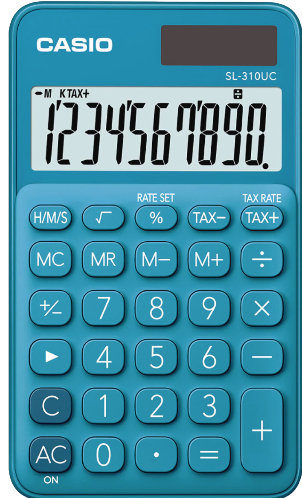

<<<<<<< HEAD
<<<<<<< HEAD
# Kata_Calculadora
=======
=======
>>>>>>> Initial commit

# Calculadora

Código para un programa de una calculadora en el lenguaje de Java. 
<<<<<<< HEAD
>>>>>>> [📝] readme
=======
=======
# Kata_Calculadora
>>>>>>> Initial commit
>>>>>>> Initial commit
